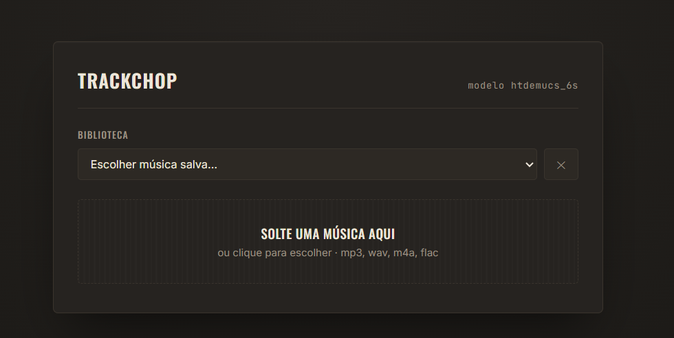

# TrackChop
 ### V1.0.1

TrackChop é uma aplicação web que separa músicas em múltiplas faixas usando IA (Demucs),
permitindo ouvir cada instrumento de forma isolada diretamente no navegador. Ideal para tirar músicas e praticar.

Você pode separar:
- bateria
- baixo
- guitarra
- teclado
- voz
- outros

Tudo roda localmente no seu computador.

---

# 📦 Download

O TrackChop pode ser utilizado de duas formas:

* Instalador (.exe) — recomendado para a maioria dos usuários.
* Código-fonte — para quem deseja estudar, modificar ou contribuir com o projeto.

---

## 💻 Instalação via executável (.exe)

### 1. Baixar o instalador

A versão mais recente do TrackChop está disponível na página de **Releases**

**➡️ [Baixar a versão mais recente](https://github.com/Euriksei/TrackChop/releases/latest)**

O arquivo disponibilizado será:

```text
TrackChopInstaller.exe
```

---

### 2. Instalar

Ao executar o .exe elecione a pasta de destino e aguarde o processo de instalação.

---

### 3. Abrir o Aplicativo

Use o atalho criado para abrir a pagina web em 
(http://localhost:5000) acessar as funcionalidades da aplicação

---

## 👨‍💻 Executando a partir do código-fonte

Caso prefira utilizar o repositório clonado, siga os passos abaixo.

1. Clonar o repositório 
* Crie uma pasta e abra o CMD dentro dela

```CMD
git clone https://github.com/Euriksei/trackchop.git 
cd trackchop
```

2. A versão python utlizada no projeto foi a 3.12, caso você esta utilizando outra,
vamos optar por utilizar um ambiente virtual com a versão recomendada.

```Python
py -3.12 -m venv venv
```

3. Ativar o ambiente virtual

```PowerShell
.venv\venve\Scripts|activate.ps1 
```

```CMD
venv\Scripts\activate.bat
```

4. Dentro do venv instale as dependencias

```CMD
pip install -r requirements.txt
```

5. Executar a aplicação

```Python
py app/app.py
```

Após iniciar o servidor, abra o navegador e acesse:

http://localhost:5000


## 📱 Utilização em Celular (mesma rede Wi-Fi)

Qualquer dispositivo conectado a mesma rede wifi do computador pode ter acesso a essa ferramenta.
Basta verificar no CMD em qual endereço de rede a aplicação esta rodando, e acessar esse mesmo endereço no navegador

Ex:
```IP
http://192.168.21.43:5000
```

⚠️ Mesmo com acesso simultaneos so é possivel fazer o upload de um arquivo por vez

---

# 🎛️ Utilização

Com a aplicação e a pagina web funcionando é extremamente necessario manter a tela
do CMD aberta para que o programa continue rodando.



1. Usuário envia uma música

2. O backend usa IA (Demucs) para separar as faixas

3. O processamento ocorre localmente no PC

  - Por ser um processo que ocorre diretamente na GPU do computador,
  pode levar em media de 2 a 5 minutos dependendo das configurações do 
  computador e do tamanho da musica.

4. O navegador exibe as faixas separadas em tempo real

5. O usuário pode:
  * ativar/desativar instrumentos
  * controlar volume individual
  * sincronizar playback
  * baixar arquivos .wav


Abra esse endereço no navegador. Arraste uma música e acompanhe as faixas "acendendo"
conforme ficam prontas.

---

## 🎵 Usando o player

Depois que todas as faixas terminam de processar, aparece um player embaixo da mesa:

- **Clique em qualquer faixa** (bateria, baixo, guitarra, teclado, voz, outros) pra
  ativá-la, silenciá-la ou reduzir o volume — a barra de nível "apaga" quando a faixa está muda.
- Combine quantas quiser tocando juntas (ex: só baixo + bateria, ou voz + guitarra).
- O **▶** toca/pausa todas as faixas juntas, sempre sincronizadas.
- A **barra de progresso** funciona como em qualquer player — arraste para navegar na música.
- Cada faixa também tem um link **"baixar"** abaixo, se quiser o arquivo `.wav` separado.

Tudo isso toca direto no navegador (usando os próprios arquivos separados), sem precisar
baixar nada antes de ouvir. Durante a separação, a barra de cada faixa mostra o progresso
em porcentagem.

### 📚 Biblioteca (não precisa reprocessar)

Toda música separada fica salva automaticamente. Na próxima vez que você abrir o app,
aparece uma seção **"Biblioteca"** no topo, listando as músicas já separadas — clique no
nome pra abrir o player instantaneamente, sem esperar o processamento de novo.

- Os arquivos ficam guardados em `resultados/` e o índice da biblioteca em `biblioteca.json`.
- Pra remover uma música da biblioteca (e liberar espaço em disco), clique no **✕** ao lado
  do item.
- Isso funciona mesmo depois de fechar e abrir o servidor de novo — os dados não se perdem.

---

## ⚠️ Limitações importantes

- **Seu PC precisa estar ligado e com o CMD rodando** para o app funcionar,
  tanto pra você quanto pra quem acessar pela rede local.
- **Tamanho máximo de upload**: 100MB por arquivo (tamanho ajustavem em novas versões).
- Primeira execução do Demucs pode demorar (download do modelo ~300MB)

---

# ⭐ Próximas Features

Algumas funcionalidades planejadas para as próximas versões do TrackChop:

* 🎚️ **Mute e Solo**:
Permitir mutar ou isolar uma faixa inteira com apenas um clique.

* 🎼 **Alteração de tom (Pitch Shift)**
Aumentar ou diminuir o tom da música sem a necessidade de reprocessá-la.

* 🎧 **Controle de panorama (Pan)**
Ajustar o posicionamento de cada faixa entre os canais esquerdo e direito do fone ou caixa de som.

* 🔊 **Controle de ganho (Gain)**
Permitir aumentar ou reduzir o volume de uma faixa além do nível original.

* ⚡ **Melhorias de desempenho**
Otimizações no processamento e na interface para reduzir o tempo de espera e melhorar a experiência de uso.

* 📱 **Melhor experiência em dispositivos móveis**
Ajustes na interface para tornar o uso mais confortável em celulares e tablets.

---

# 🚀 Observações

Este projeto foi feito para uso local e experimental, focado em:

- Processamento de áudio com IA
- Sistemas web locais
- Manipulação de áudio em tempo real
- integração backend + frontend
- Prática musical

---

# 🧠 Arquitetura técnica

## Backend

* Python + Flask
* Processamento com Demucs (IA)
* Polling de status (/status/<job_id>)

## Frontend
* HTML + CSS + JavaScript puro
* Player sincronizado multi-áudio
* Faders de volume individuais
* Biblioteca local via